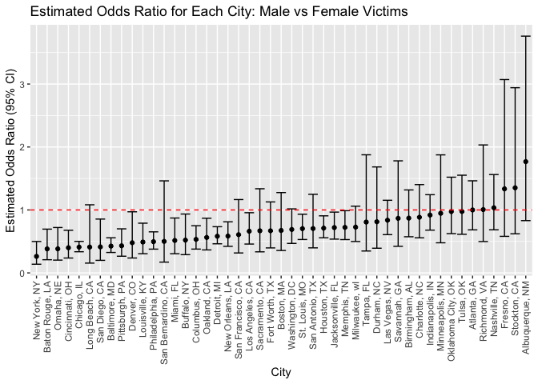
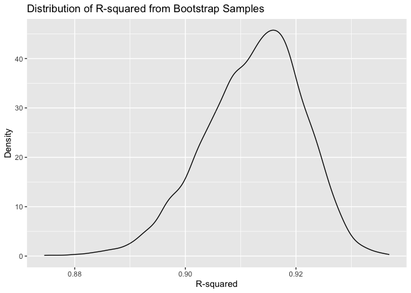
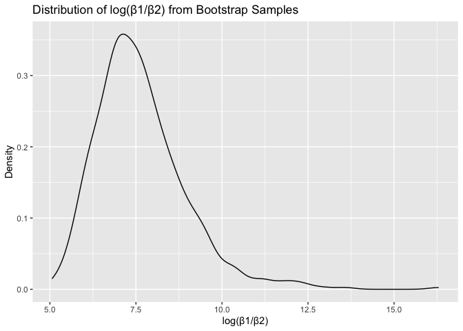
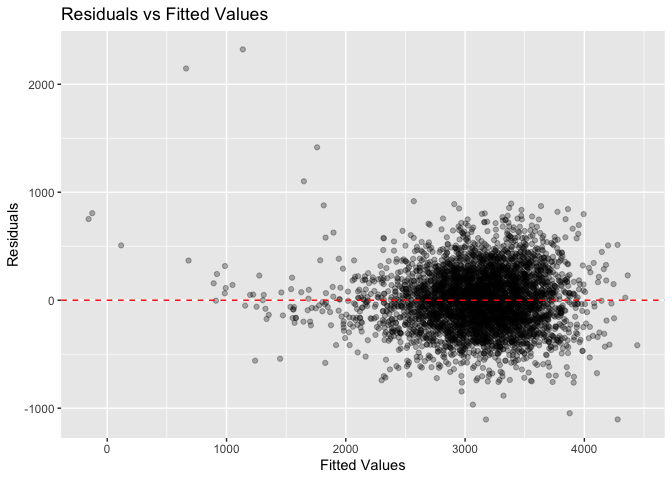

hw6
================
Minseo Brenda Kim
2025-12-01

## Load libraries

``` r
library(tidyverse)
```

    ## ── Attaching core tidyverse packages ──────────────────────── tidyverse 2.0.0 ──
    ## ✔ dplyr     1.1.4     ✔ readr     2.1.5
    ## ✔ forcats   1.0.0     ✔ stringr   1.5.1
    ## ✔ ggplot2   3.5.2     ✔ tibble    3.2.1
    ## ✔ lubridate 1.9.4     ✔ tidyr     1.3.1
    ## ✔ purrr     1.0.2     
    ## ── Conflicts ────────────────────────────────────────── tidyverse_conflicts() ──
    ## ✖ dplyr::filter() masks stats::filter()
    ## ✖ dplyr::lag()    masks stats::lag()
    ## ℹ Use the conflicted package (<http://conflicted.r-lib.org/>) to force all conflicts to become errors

``` r
library(modelr)
library(broom)
```

    ## 
    ## Attaching package: 'broom'
    ## 
    ## The following object is masked from 'package:modelr':
    ## 
    ##     bootstrap

``` r
library(p8105.datasets)
```

# Problem 1

The Washington Post has gathered data on homicides in 50 large U.S.
cities and made the data available through a GitHub repository.

``` r
# Load data and clean
homicide_df = 
  read_csv("https://raw.githubusercontent.com/washingtonpost/data-homicides/master/homicide-data.csv") |>
  mutate(
    city_state = str_c(city, ", ", state), # create city_state variable
    resolved = case_when(
      disposition == "Closed by arrest" ~ 1,
      disposition == "Open/No arrest" ~ 0,
      disposition == "Closed without arrest" ~ 0
    ),
    victim_age = as.numeric(victim_age) #Be sure that victim_age is numeric
  ) |>
  filter(
    !city_state %in% c("Dallas, TX", "Phoenix, AZ", "Kansas City, MO", "Tulsa, AL"), #Omit cities Dallas, TX; Phoenix, AZ; and Kansas City, MO; Tulsa, AL
    victim_race %in% c("White", "Black") #limit your analysis those for whom victim_race is white or black
  ) |>
  select(city_state, resolved, victim_age, victim_sex, victim_race)
```

    ## Rows: 52179 Columns: 12
    ## ── Column specification ────────────────────────────────────────────────────────
    ## Delimiter: ","
    ## chr (9): uid, victim_last, victim_first, victim_race, victim_age, victim_sex...
    ## dbl (3): reported_date, lat, lon
    ## 
    ## ℹ Use `spec()` to retrieve the full column specification for this data.
    ## ℹ Specify the column types or set `show_col_types = FALSE` to quiet this message.

``` r
head(homicide_df)
```

    ## # A tibble: 6 × 5
    ##   city_state      resolved victim_age victim_sex victim_race
    ##   <chr>              <dbl>      <dbl> <chr>      <chr>      
    ## 1 Albuquerque, NM        0         15 Female     White      
    ## 2 Albuquerque, NM        0         72 Female     White      
    ## 3 Albuquerque, NM        0         91 Female     White      
    ## 4 Albuquerque, NM        0         56 Male       White      
    ## 5 Albuquerque, NM        0         NA Male       White      
    ## 6 Albuquerque, NM        1         43 Female     White

For the city of Baltimore, MD, use the glm function to fit a logistic
regression with resolved vs unresolved as the outcome and victim age,
sex and race as predictors.

``` r
baltimore_df = 
  homicide_df |>
  filter(city_state == "Baltimore, MD")

baltimore_glm = 
  glm(resolved ~ victim_age + victim_sex + victim_race, 
      data = baltimore_df, 
      family = binomial())

baltimore_glm |>
  tidy() |>
  mutate(
    OR = exp(estimate),
    CI_lower = exp(estimate - 1.96 * std.error),
    CI_upper = exp(estimate + 1.96 * std.error)
  ) |>
  filter(term == "victim_sexMale") |>
  select(term, OR, CI_lower, CI_upper) |>
  knitr::kable(digits = 3)
```

| term           |    OR | CI_lower | CI_upper |
|:---------------|------:|---------:|---------:|
| victim_sexMale | 0.426 |    0.325 |    0.558 |

Now run glm for each of the cities in your dataset, and extract the
adjusted odds ratio (and CI) for solving homicides comparing male
victims to female victims.

``` r
all_glm = 
  homicide_df |>
  nest(data = -city_state) |>
  mutate(
    models = map(data, \(df) glm(resolved ~ victim_age + victim_sex + victim_race, 
                                  data = df, family = binomial())),
    results = map(models, tidy)
  ) |>
  select(city_state, results) |>
  unnest(results) |>
  filter(term == "victim_sexMale") |>
  mutate(
    OR = exp(estimate),
    CI_lower = exp(estimate - 1.96 * std.error),
    CI_upper = exp(estimate + 1.96 * std.error)
  ) |>
  select(city_state, OR, CI_lower, CI_upper)
```

Create a plot that shows the estimated ORs and CIs for each city.
Organize cities according to estimated OR, and comment on the plot.

``` r
all_glm |>
  mutate(city_state = fct_reorder(city_state, OR)) |>
  ggplot(aes(x = city_state, y = OR)) +
  geom_point() +
  geom_errorbar(aes(ymin = CI_lower, ymax = CI_upper)) +
  geom_hline(yintercept = 1, linetype = "dashed", color = "red") +
  theme(axis.text.x = element_text(angle = 90, hjust = 1, vjust = 0.5)) +
  labs(
    title = "Estimated Odds Ratio for Each City: Male vs Female Victims",
    x = "City",
    y = "Estimated Odds Ratio (95% CI)"
  )
```

<!-- -->

Most cities show odds ratios below 1, and New York, NY has the smallest
Odds Ratio. OR below 1 expalines that homicides with male victims have
lower odds of being resolved compared to female victims. Only three
cities, Albuquerque, NM, Stockton, CA, and Fresno, CA, have confidence
intervals that exceed 1.0, with Albuquerque having the highest point.
However, these cities also show notably wider confidence intervals,
suggesting greater uncertainty in the estimates, likely because of
smaller sample sizes. Also, for most cities, the confidence intervals do
not cross the reference line at OR = 1, indicating statistically
significant differences in resolution rates by victim gender.

# Problem 2

For this problem, we’ll use the Central Park weather data we’ve seen
elsewhere. The code chunk below will import these data from the
p8105.datasets package.

``` r
# Load data
data("weather_df")

weather_df = 
  weather_df |> 
  select(name, tmax, tmin, prcp) |>
  filter(name == "CentralPark_NY") |>
  drop_na()

head(weather_df)
```

    ## # A tibble: 6 × 4
    ##   name            tmax  tmin  prcp
    ##   <chr>          <dbl> <dbl> <dbl>
    ## 1 CentralPark_NY   4.4   0.6   157
    ## 2 CentralPark_NY  10.6   2.2    13
    ## 3 CentralPark_NY   3.3   1.1    56
    ## 4 CentralPark_NY   6.1   1.7     5
    ## 5 CentralPark_NY   5.6   2.2     0
    ## 6 CentralPark_NY   5     1.1     0

Use 5000 bootstrap samples and, for each bootstrap sample, produce
estimates of these two quantities.

``` r
set.seed(123)

boot_results = 
  weather_df |>
  modelr::bootstrap(n = 5000) |>
  mutate(
    models = map(strap, \(df) lm(tmax ~ tmin + prcp, data = df)),
    results_r2 = map(models, glance),
    results_beta = map(models, tidy)
  ) |>
  select(.id, results_r2, results_beta) |>
  unnest(results_r2) |>
  select(.id, r.squared, results_beta) |>
  unnest(results_beta) |>
  select(.id, r.squared, term, estimate) |>
  pivot_wider(
    names_from = term,
    values_from = estimate
  ) |>
  rename(beta_0 = `(Intercept)`, beta_1 = tmin, beta_2 = prcp) |>
  mutate(log_beta_ratio = log(beta_1 / beta_2))
```

Plot the distribution of your estimates, and describe these in words.

``` r
# distribution of r-squared
boot_results |>
  ggplot(aes(x = r.squared)) +
  geom_density() +
  labs(
    title = "Distribution of R-squared from Bootstrap Samples",
    x = "R-squared",
    y = "Density"
  )
```

<!-- -->

The distribution of r-squared values is approximately normal with a
slight left skew, centered around 0.917. This suggests that the model
explains approximately 92% of the variance in maximum temperature, with
relatively consistent performance across bootstrap samples.

``` r
# distribution of β1/β2
boot_results |>
  filter(!is.na(log_beta_ratio)) |>
  ggplot(aes(x = log_beta_ratio)) +
  geom_density() +
  labs(
    title = "Distribution of log(β1/β2) from Bootstrap Samples",
    x = "log(β1/β2)",
    y = "Density"
  )
```

<!-- -->

The distribution of log(β₁/β₂) is right-skewed with a peak around 7.5
and a long tail extending to approximately 16. This suggests that the
ratio of coefficients varies considerably across bootstrap samples, with
some samples producing much larger ratios than others. It seems like β₂
is close to zero, which explains small changes in its value across
bootstrap samples can lead to large changes in the ratio, particularly
when β₂ is very small. It might create the extended right tail in the
distribution.

``` r
# 95% confidence intervals
boot_results |>
  summarize(
    r2_ci_lower = quantile(r.squared, 0.025),
    r2_ci_upper = quantile(r.squared, 0.975),
    log_beta_ci_lower = quantile(log_beta_ratio, 0.025, na.rm = TRUE),
    log_beta_ci_upper = quantile(log_beta_ratio, 0.975, na.rm = TRUE)
  ) |>
  knitr::kable(digits = 3)
```

| r2_ci_lower | r2_ci_upper | log_beta_ci_lower | log_beta_ci_upper |
|------------:|------------:|------------------:|------------------:|
|       0.893 |       0.928 |              5.72 |             11.02 |

The 95% confidence interval for r-squared is approximately (0.893,
0.928), indicating high and consistent model fit. The 95% confidence
interval for log(β₁/β₂) is approximately (5.72, 11.02), reflecting the
wide variability in this product, likely because of the small magnitude
and variability of the precipitation coefficient.

# Problem 3

``` r
# Load data and clean
birthweight_df = 
  read_csv("https://p8105.com/data/birthweight.csv") |>
  mutate(
    babysex = factor(babysex, levels = c(1, 2), labels = c("male", "female")),
    frace = factor(frace, levels = c(1, 2, 3, 4, 8, 9), 
                   labels = c("White", "Black", "Asian", "Puerto Rican", "Other", "Unknown")),
    mrace = factor(mrace, levels = c(1, 2, 3, 4, 8), 
                   labels = c("White", "Black", "Asian", "Puerto Rican", "Other")),
    malform = factor(malform, levels = c(0, 1), labels = c("absent", "present"))
  )
```

    ## Rows: 4342 Columns: 20
    ## ── Column specification ────────────────────────────────────────────────────────
    ## Delimiter: ","
    ## dbl (20): babysex, bhead, blength, bwt, delwt, fincome, frace, gaweeks, malf...
    ## 
    ## ℹ Use `spec()` to retrieve the full column specification for this data.
    ## ℹ Specify the column types or set `show_col_types = FALSE` to quiet this message.

``` r
sum(is.na(birthweight_df))
```

    ## [1] 0

``` r
head(birthweight_df)
```

    ## # A tibble: 6 × 20
    ##   babysex bhead blength   bwt delwt fincome frace gaweeks malform menarche
    ##   <fct>   <dbl>   <dbl> <dbl> <dbl>   <dbl> <fct>   <dbl> <fct>      <dbl>
    ## 1 female     34      51  3629   177      35 White    39.9 absent        13
    ## 2 male       34      48  3062   156      65 Black    25.9 absent        14
    ## 3 female     36      50  3345   148      85 White    39.9 absent        12
    ## 4 male       34      52  3062   157      55 White    40   absent        14
    ## 5 female     34      52  3374   156       5 White    41.6 absent        13
    ## 6 male       33      52  3374   129      55 White    40.7 absent        12
    ## # ℹ 10 more variables: mheight <dbl>, momage <dbl>, mrace <fct>, parity <dbl>,
    ## #   pnumlbw <dbl>, pnumsga <dbl>, ppbmi <dbl>, ppwt <dbl>, smoken <dbl>,
    ## #   wtgain <dbl>

Propose a regression model for birthweight. This model may be based on a
hypothesized structure for the factors that underly birthweight, on a
data-driven model-building process, or a combination of the two.
Describe your modeling process and show a plot of model residuals
against fitted values – use add_predictions and add_residuals in making
this plot.

``` r
bw_model = lm(bwt ~ bhead + blength + gaweeks + delwt + smoken + mrace, 
              data = birthweight_df)

bw_model |>
  tidy() |>
  knitr::kable(digits = 3)
```

| term              |  estimate | std.error | statistic | p.value |
|:------------------|----------:|----------:|----------:|--------:|
| (Intercept)       | -5752.262 |    97.292 |   -59.124 |   0.000 |
| bhead             |   130.023 |     3.425 |    37.967 |   0.000 |
| blength           |    75.667 |     2.024 |    37.382 |   0.000 |
| gaweeks           |    12.345 |     1.457 |     8.472 |   0.000 |
| delwt             |     2.283 |     0.196 |    11.623 |   0.000 |
| smoken            |    -4.847 |     0.589 |    -8.235 |   0.000 |
| mraceBlack        |  -147.369 |     9.259 |   -15.916 |   0.000 |
| mraceAsian        |   -74.852 |    42.548 |    -1.759 |   0.079 |
| mracePuerto Rican |  -117.726 |    18.787 |    -6.266 |   0.000 |

I proposed a model based on factors hypothesized to influence
birthweight:

- `bhead`: Baby’s head circumference - indicator of fetal development
- `blength`: Baby’s length - direct measure of physical growth
- `gaweeks`: Gestational age - longer gestation generally means higher
  weight
- `delwt`: Mother’s weight at delivery - maternal nutrition affects
  fetal growth
- `smoken`: Smoking during pregnancy - known risk factor for low
  birthweight
- `mrace`: Mother’s race - accounts for genetic and socioeconomic
  factors

``` r
# plot of model residuals against fitted values
birthweight_df |>
  add_predictions(bw_model) |>
  add_residuals(bw_model) |>
  ggplot(aes(x = pred, y = resid)) +
  geom_point(alpha = 0.3) +
  geom_hline(yintercept = 0, color = "red", linetype = "dashed") +
  labs(
    title = "Residuals vs Fitted Values",
    x = "Fitted Values",
    y = "Residuals"
  )
```

<!-- -->

Compare your model to two others:

- One using length at birth and gestational age as predictors (main
  effects only)
- One using head circumference, length, sex, and all interactions
  (including the three-way interaction) between these

Make this comparison in terms of the cross-validated prediction error;
use crossv_mc and functions in purrr as appropriate.

``` r
compare_df = 
  crossv_mc(birthweight_df, 100) |>
  mutate(
    train = map(train, as_tibble),
    test = map(test, as_tibble)
  ) |>
  mutate(
    bw_model = map(train, \(df) lm(bwt ~ bhead + blength + gaweeks + delwt + smoken + mrace, data = df)),
    main_effects_model = map(train, \(df) lm(bwt ~ blength + gaweeks, data = df)),
    interaction_model = map(train, \(df) lm(bwt ~ bhead * blength * babysex, data = df))
  ) |>
  mutate(
    rmse_my = map2_dbl(bw_model, test, \(mod, df) rmse(mod, df)),
    rmse_main = map2_dbl(main_effects_model, test, \(mod, df) rmse(mod, df)),
    rmse_interaction = map2_dbl(interaction_model, test, \(mod, df) rmse(mod, df))
  )
```

``` r
#rmse summary
compare_df |>
  summarize(
    my_model_rmse = mean(rmse_my),
    main_effects_rmse = mean(rmse_main),
    interaction_rmse = mean(rmse_interaction)
  ) |>
  knitr::kable(digits = 2)
```

| my_model_rmse | main_effects_rmse | interaction_rmse |
|--------------:|------------------:|-----------------:|
|        276.19 |             335.4 |           290.28 |

Based on the cross-validation results, my proposed `bw_model` achieves
the best predictive performance with the lowest mean RMSE of 275.76
grams. The main effects model (length + gestational age only) shows
substantially worse performance at 334.38 RMSE, indicating that these
two predictors are insufficient to accurately predict birthweight. The
interaction model (head circumference × length × sex) performs
moderately well with an RMSE of 289.69.

`bw_model` suggests that including additional predictors—specifically
mother’s delivery weight (`delwt`), smoking during pregnancy (`smoken`),
and mother’s race (`mrace`), which meaningfully improves prediction
accuracy beyond just the baby’s physical measurements. These maternal
characteristics capture important aspects of prenatal environment and
maternal health that affect fetal growth.
